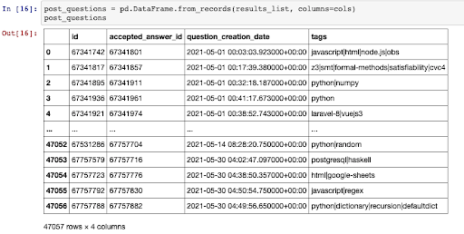
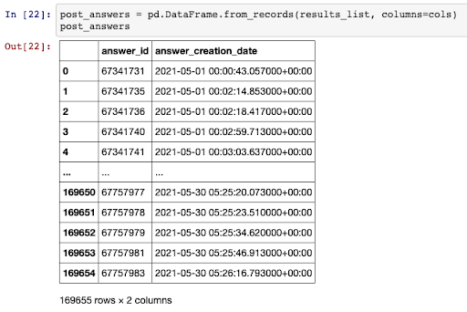
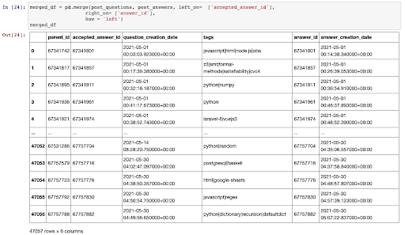
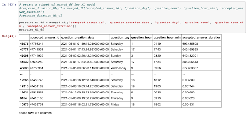

# Final Project: First Segment Project Deliverable

## Selected Topic: Stack Overflow Response Analysis

## Overview

As students who use stack overflow as a learning tool, we want data on the best times to be online and post our questions to get an approved answer quickly and keep our momentum as we learn. The purpose of this project is to determine the relationships between the features on Stack Overflow such as time of day, tags, question creation date in order to help users make the most of their studying time.

## Data Sources
Our team is using the Stack Overflow Big Data dataset from Google Cloud Platform (GCP, formerly BigQuery). For the first segment, the GCP dataset served as the database. Due to the size of the sample data, a local database was not created at this stage. Sample data was pulled from GCP, and stored and manipulated within Pandas DataFrames. 

The Stack Overflow GCP dataset has several tables that store information about posts, users, badges, tags and other attributes. For this segment of the project, the team queried two tables to extract sample data necessary to test the Machine Learning model. These tables were the “post_questions” and “post_answers” tables. More tables will be queried for future segments of the project.

## Questions we hope to answer

- What are factors that lead to short times to approved answers?
- What is the mean time between question and approved answer?
- What is the median time between question and approved answer?
- What are the top ten times of day where the most questions are posed?
- What are the top ten times of day where the most approved answers are provided?
- What times of each day see response rates of less than an hour?
- What is the mean time between question and approved answer by tag?
- What is the median time between question and approved answer by tag?
- What is the correlation between tag popularity and time to an approved answer?
- What is the correlation between the number of tags and time to an approved answer? 
- Do the number of tags impact the number of approved responses?
- What is the correlation between the badged questions and time to an approved answer?

## Database
As mentioned above, the GCP Stack Overflow dataset serves as the database for the first segment of this project. By querying the “post_questions” and “post_answers” tables from GCP, we extracted a sample of data to perform Exploratory Data Analysis and cleaned and transformed it to provide the sample data needed to feed the Machine Learning model. 

### Exploratory Data Analysis

To create our sample database for further analysis and machine learning model, we queried from the Stack Overflow Data dataset obtained from BigQuery (Google Cloud Platform). 

As we are interested in a subset of this large data with 20 columns of data, we performed several queries and then cleaned the data to create a **post_questions** Pandas DataFrame that will provide insight on Stack Overflow questions:
Reduced scope of our data so that **question_creation_date** had data after May 1, 2021
Filtered data so we’re only dealing with questions that had an accepted answer (identified with a not null value under **accepted_answer_id**) 

We performed similar steps to create a cleaned **post_answers** Pandas DataFrame that will provide insight on Stack Overflow answer statistics:
Reduced scope of our data so that **answer_creation_date** had data after May 1, 2021
No filtering was required for the **answer_id** at this point of our EDA since we’ll be merging the two DataFrames

We merged the two DataFrames with the rationale being that the **accepted_answer_id** from the **post_questions** DF is identical to the **answer_id** from the **post_answers** DF. That way, our merged DF will display questions that had accepted answers for our analysis. 

After creating our merged DF, we performed several cleaning steps and transformations to arrive at our finalized DF for the initial stage of our project:
Compared **accepted_answer_id** and **answer_id** columns to verify they were identical 
Dropped **answer_id** because of the redundancy 
Extracted the weekday from the **question_creation_date** and **answer_creation_date** and added two new columns:
**question_day**
**answer_day**
Extracted the hour and hour:minute from the **question_creation_date** and **answer_creation_date** and added four new columns
**question_hour**
**question_hour_min**
**answer_hour**
**answer_hour_min**
Subtracted the **answer_creation_date** from the **question_creation_date** (to calculate the duration between when an accepted answer was given to a question) and added a new column:
**accepted_answer_duration**
Removed data rows where **accepted_answer_duration** had a value of 0.000000
We used .groupby and counted 172 rows out of 46,885 
This could be due to a glitch in Stack Overflow as it’s impossible that an answer was given at the exact time a question was posted 
As these rows account for 0.367% of the merged DF, we decided to drop them
For our initial exploration into machine learning models, we created a subset of the DF and selected the following columns:
**accepted_answer_id**
**question_creation_date**
**question_day**
**question_hour**
**question_hour_min**
**accepted_answer_duration**

The following figure shows the ERD for the tables used in this segment of the project:

.png)

## Machine Learning Component
### *Provisional Machine Learning Model - Regression Analysis*

The question we hope to answer with the machine learning component of our project is:

  <i><b>"What are factors that lead to short times to approved answers?"</b></i> 

In order to determine the most appropriate model for the Stack Overflow data, we exlpored relationships between various features within the data and the estimated response time. 
By using a regression model we established that there was no correlation between the features that were used in the regression model.   

The notebook used for the analysis is *ML_deliverable1_convert_to_int.ipynb*. Our results are summarized below.

We arrived at this conclusion via the following steps:

***Regression Analysis on "Accepted Answer Duration" With "Hour Question Was Posted" as Feature***

- We used a transformation function to convert the data type of column *question_day* from object to integer in order to make the data compatible with the sklearn library:

 

- We then modelled the data using regression analysis on the features *question_hour* to see if any correlation exists:

  

As seen in the image above the line of best fit is a vertical line indicating no correlation between time of day and accepted answer duration.

We then decided to try the analysis again with data that is less discrete to see if we could get a more precise outcome. To do so we modelled the data to see if there was a relationship between the minute of the day the question was asked and the accepted answer duration.

***Regression Analysis on "Accepted Answer Duration" With "Minute of the Day Question Was Posted" as Feature***

- Firstly we transformed the column *question_hour_min* to parse only the minute amount

 

- We then created the column *question_time* using the function below:

 

<BLOCKQUOTE>By multiplying the hour the question was asked (<i>question_hour</i>) and adding the minutes (<i>question_hour_minute</i>) to it we obtained the minute of the day. Note that     <i>question_hour</i> is measured in military time.
</BLOCKQUOTE>

- We then performed a similar regression analysis on the new feature:

  
  

 

We found no change in correlation. 

Based on our findings our next steps will be:

- explore the relationship between other features in the data set and accepted answer duration.
- refine the question we wish for our machine learning model to explore
- explore other machine learning models that can yield better results for what we are trying to investigate

## **Communications protocols** 

- Each team member will have their own branch to this repository, named after their first names for clarity

    - Saudia (smanowar) branch: https://github.com/smanowar/final-project/tree/saudia

    - Esther (emc1518) branch: https://github.com/smanowar/final-project/tree/esther

    - Suweatha (ssanmug) branch : https://github.com/smanowar/final-project/tree/suweatha

    - Nisha (nishavenkatesh11) branch: https://github.com/smanowar/final-project/tree/nisha

- Each commit on a branch must include the following information in the comments:

  - Description of the update
  - Identify which component of the project it contributes to
  - Is the update complete or partial

